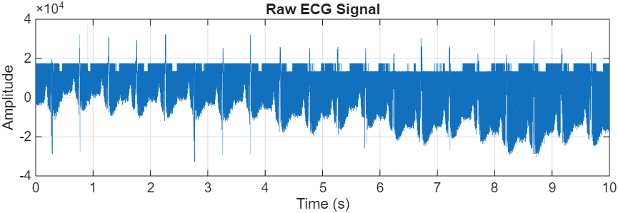
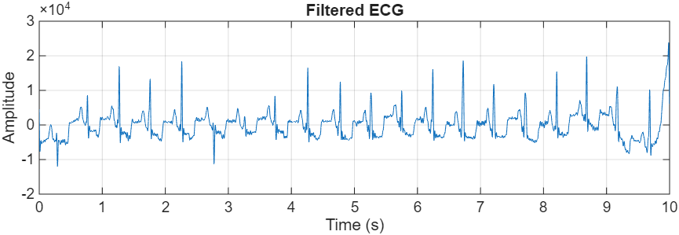
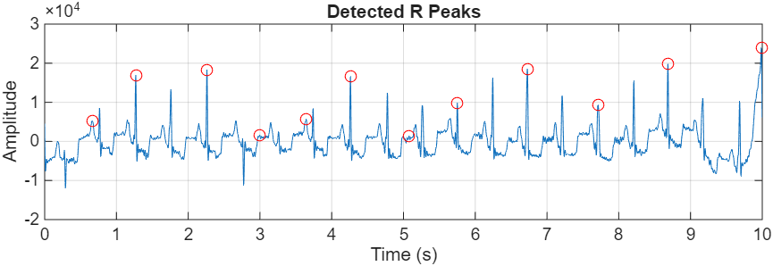
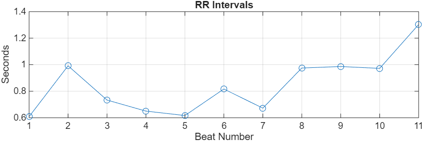
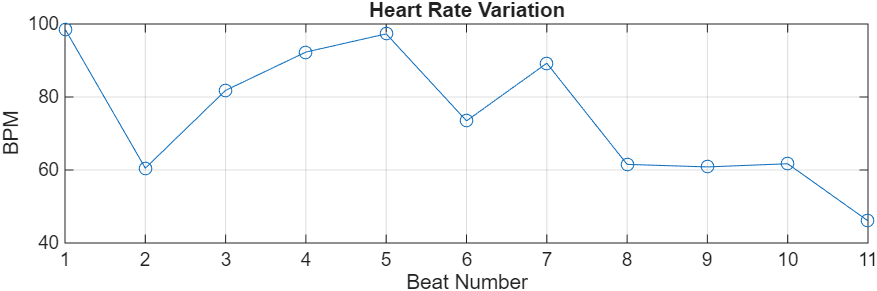
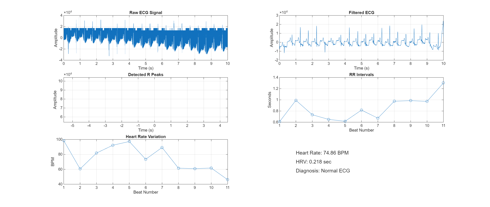

**#ECG Signal Analysis using MATLAB (MIT-BIH Dataset)**

This project performs **ECG (Electrocardiogram) signal analysis using MATLAB** for the course **Signals and Systems (BEC403)**.  
The ECG signal is processed using signal processing techniques to extract important features such as **R-peaks, RR intervals, heart rate, and heart rate variability (HRV)**.

The ECG data used in this project is taken from the **MIT-BIH Arrhythmia Database**, a widely used biomedical dataset for cardiovascular signal analysis.

---

## Project Overview

Electrocardiogram (ECG) signals represent the electrical activity of the human heart over time. Analyzing ECG signals helps in detecting abnormal heart conditions such as **arrhythmia, bradycardia, and tachycardia**.

In this project, MATLAB is used to perform ECG signal processing and analysis. The program loads ECG data from the dataset, filters noise from the signal, detects R-peaks, calculates RR intervals, and determines heart rate and heart rate variability.

The final results are displayed through graphical plots that visualize the ECG waveform and its extracted features.

---

## Dataset

Dataset used: **MIT-BIH Arrhythmia Database**

Source:  
https://physionet.org/content/mitdb/

Dataset characteristics:

- Sampling frequency: **360 Hz**
- ECG signals stored in **.dat format**
- Two-channel ECG recordings

In this project, only the **first channel of the ECG signal** is used for analysis.  
The first **10 seconds of ECG data** are extracted for processing.

---

## Methodology

The ECG signal analysis is performed using the following steps:

1. Load ECG data from the MIT-BIH dataset
2. Extract the first 10 seconds of ECG signal
3. Apply bandpass filtering (0.5 Hz – 40 Hz)
4. Detect R-peaks using MATLAB `findpeaks()` function
5. Calculate RR intervals
6. Compute heart rate (BPM)
7. Calculate heart rate variability (HRV)
8. Generate visualization plots for ECG analysis

---

## MATLAB Implementation

Main MATLAB script used in this project:

```
ecg_full_analysis.m
```

Key MATLAB functions used:

| Function | Purpose |
|--------|--------|
| fread() | Read ECG data file |
| butter() | Design Butterworth bandpass filter |
| filtfilt() | Apply zero-phase filtering |
| findpeaks() | Detect R-peaks in ECG signal |
| diff() | Calculate RR intervals |
| mean() | Calculate average heart rate |
| std() | Calculate heart rate variability |

---

## Results

The MATLAB program generates multiple plots to visualize the ECG signal and its features.

### Raw ECG Signal



### Filtered ECG Signal



### R-Peak Detection



### RR Intervals



### Heart Rate Variation



### ECG Analysis Dashboard



---

## Example Output

From the ECG analysis:

Average Heart Rate: **74.86 BPM**

Heart Rate Variability: **0.218 sec**

Mean RR Interval: **0.848 sec**

Diagnosis: **Normal ECG**

---


## How to Run the Project

1. Install **MATLAB**.
2. Download the **MIT-BIH Arrhythmia Dataset** from PhysioNet.
3. Update the dataset path in the MATLAB script:

```
filename = 'data/mit-bih-arrhythmia-database-1.0.0/234.dat';
```

4. Run the MATLAB script:

```
ecg_full_analysis.m
```

5. MATLAB will generate ECG plots and display the analysis results.

---

## Applications

ECG signal analysis is widely used in:

- Heart disease detection
- Arrhythmia monitoring
- Biomedical signal processing
- Wearable health devices
- Remote patient monitoring systems

---

## Author

Mahendra M  
Electronics and Communication Engineering  
The National Institute of Engineering  
Mysuru, India

---

## License

This project is created for **academic and educational purposes**.
